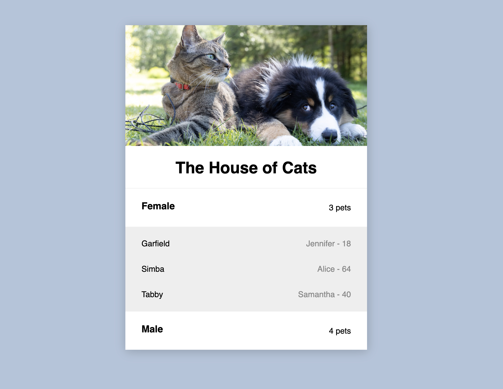

# Medibank Coding Challenge

## Overview



## Installation

-   `yarn install`
-   `yarn start`
-   To run test run `yarn test`

## Implementation & tech stacks

1. React.js with Typescript is used to build a robust frontend client with type declartion to have error free UI.
2. Styled-component to write CSS in JS and component that need styling
3. Webpack is used for module bundling and code-spliting.
4. React Testing Library & jest is used to test the UI and components

## Requirements

You need to:

-   Write some code to consume the json hosted on the above web service.
-   Output a list of all the cats in alphabetical order under a heading of the gender of their owner.
-   Output must be presentable on a web browser.
-   Submissions will only be accepted via GitHub or Bitbucket.

Please note:

-   It can be written in any language you like.
-   Use any libraries/frameworks/SDKs you choose.
-   Use industry best practices.
-   Use the code to showcase your skill and what you value in a software application.

## Example

```
Male

Angel
Molly
Tigger


Female

Gizmo
Jasper
Notes

```
